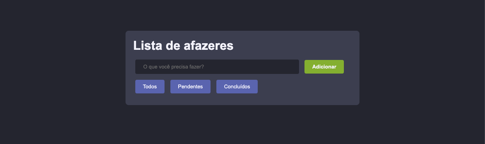
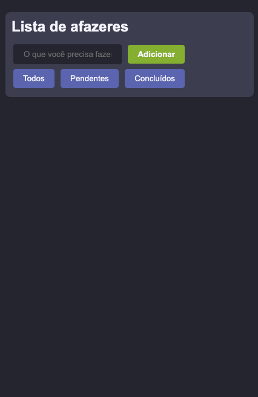

<h1 align="center">Projeto Lista de Afazeres (Todo List)</h1>

Esse projeto foi desenvolvido especialmente para o aprendizado e especificação das tecnologias abaixo.

## Recursos:

- Adicionar Tarefas: Os usuários podem adicionar novas tarefas à lista.
- Remover Tarefas: Tarefas individuais podem ser removidas.
- Filtrar Tarefas: Os usuários podem visualizar todas as tarefas, apenas as pendentes, ou apenas as concluídas.
- Responsividade: A interface se adapta a diferentes tamanhos de tela.

## 🛠 Tecnologias

As seguintes ferramentas foram usadas na construção do projeto:

- HTML5
- CSS3 
- JavaScript 

<h2 align="center">✅ Demonstração da aplicação</h2>

 
<h3 align="center"> Demonstração aplicada no Computador</h3>

 

<h3 align="center"> Demonstração aplicada no Smartphone</h3>

## Suporte a Navegadores
Este projeto é melhor visualizado nos seguintes navegadores:

- Google Chrome (Versão mais recente)
- Mozilla Firefox (Versão mais recente)
- Safari (Versão mais recente)
- Microsoft Edge (Versão mais recente)
 
Certifique-se de estar usando a versão mais atualizada do navegador para a melhor experiência.

## Autor

<h3 font-weight: 900;>Feito por Kevin Bafini</h3>

